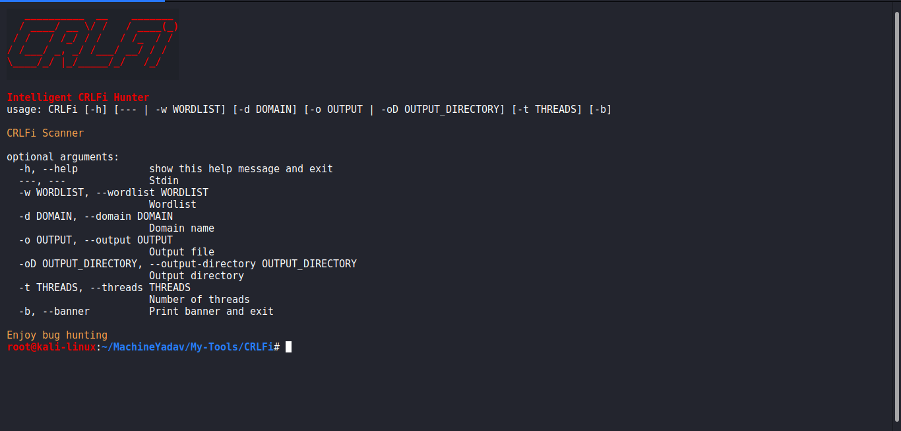

# CRLFi
&nbsp;&nbsp;&nbsp;&nbsp;&nbsp;&nbsp;&nbsp;&nbsp;&nbsp;&nbsp;&nbsp;&nbsp;&nbsp;&nbsp;&nbsp;&nbsp;&nbsp;&nbsp;&nbsp;&nbsp;&nbsp;&nbsp;&nbsp;&nbsp;&nbsp;&nbsp;&nbsp;&nbsp;&nbsp;&nbsp;&nbsp;&nbsp;&nbsp;&nbsp;&nbsp;&nbsp;&nbsp;&nbsp;&nbsp;&nbsp;&nbsp;&nbsp;&nbsp;&nbsp;&nbsp;&nbsp;&nbsp;&nbsp;&nbsp;&nbsp;&nbsp;&nbsp;&nbsp;&nbsp;&nbsp;&nbsp;&nbsp;&nbsp;&nbsp;&nbsp;
[](https://frontend.code-inspector.com/public/project/15089/CRLFi/dashboard)
[](https://frontend.code-inspector.com/public/project/15089/CRLFi/dashboard)

## Description
Fast and Automated CRLF injection scanner. Scans for CRLF injection in parameters, paths and netlocs. 

## Features
1. Automatic and concurrent scanning of CRLF injections.
2. Define your own payloads in lib/Globals.py as well as huge list of predefined payloads.
3. Scans for CRLF injection in parameters, paths and netlocs.
4. Printing feels nice and automatically skips same looking parameters, paths and domains.

## Usage
```
usage: CRLFi [-h] [--- | -w WORDLIST] [-d DOMAIN] [-oD OUTPUT_DIRECTORY] [-t THREADS] [-b]

CRLFi Finding Tool

optional arguments:
  -h, --help            show this help message and exit
  ---, ---              Stdin
  -w WORDLIST, --wordlist WORDLIST
                        Wordlist
  -d DOMAIN, --domain DOMAIN
                        Domain name
  -oD OUTPUT_DIRECTORY, --output-directory OUTPUT_DIRECTORY
                        Output directory
  -t THREADS, --threads THREADS
                        Number of threads
  -b, --banner          Print banner and exit

Enjoy bug hunting
```

## Example
1. Scan a single URL  
>> ```CRLFi -d google.com```  
2. Scan URLs from wordlist
> ```CRLFi -w /path/to/wordlist -oD `pwd` -t 10 -d domain.com```  
3. Scan from stdin
> ```assetfinder yahoo.com | CRLFi --- -t 10```

## Note
* All of my tools are works on latest version of all modules, no venv necessary
* All binary are compiled with link time optimization
* Code is made as much fast as possible and as much memory efficient as possible.

## Caveats
1. Nothing. If you think there is feel free to raise issue.

## FAQ
1. Does CRLF injection only affect HTTP/1?  
> No, I found CRLF injection on 2 http/2 enabled website with this tool. Also checkout this: [CRLF injection in HTTP2](https://security.stackexchange.com/questions/235046/does-http-2-prevent-security-vulnerabilites-like-crlf-injection)
